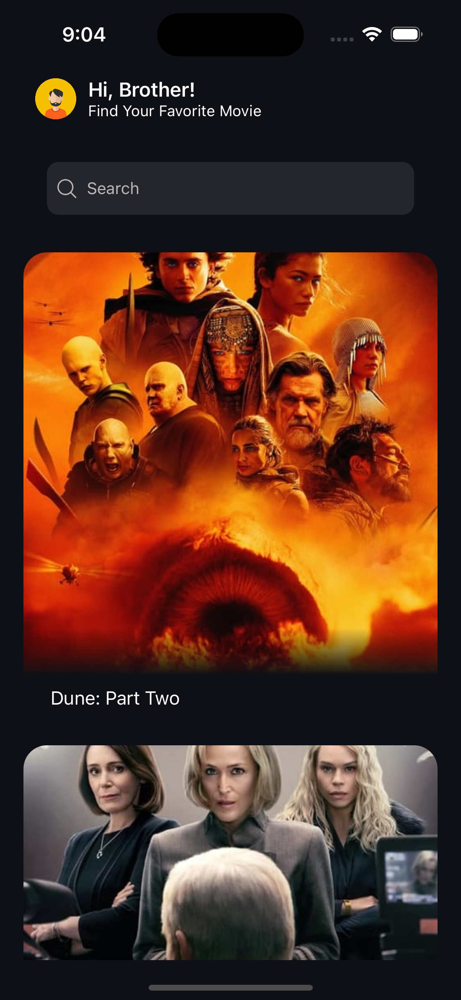
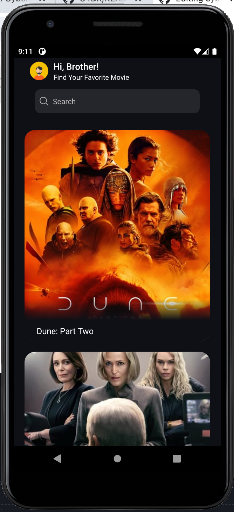
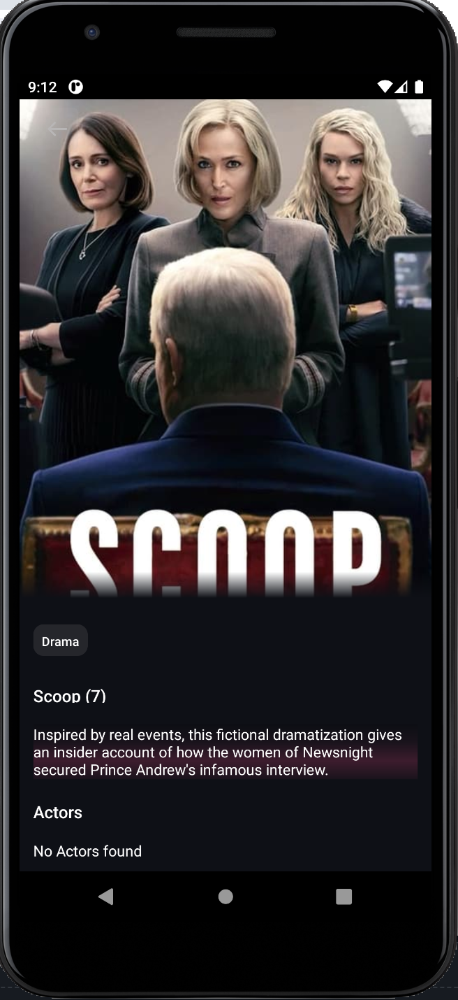
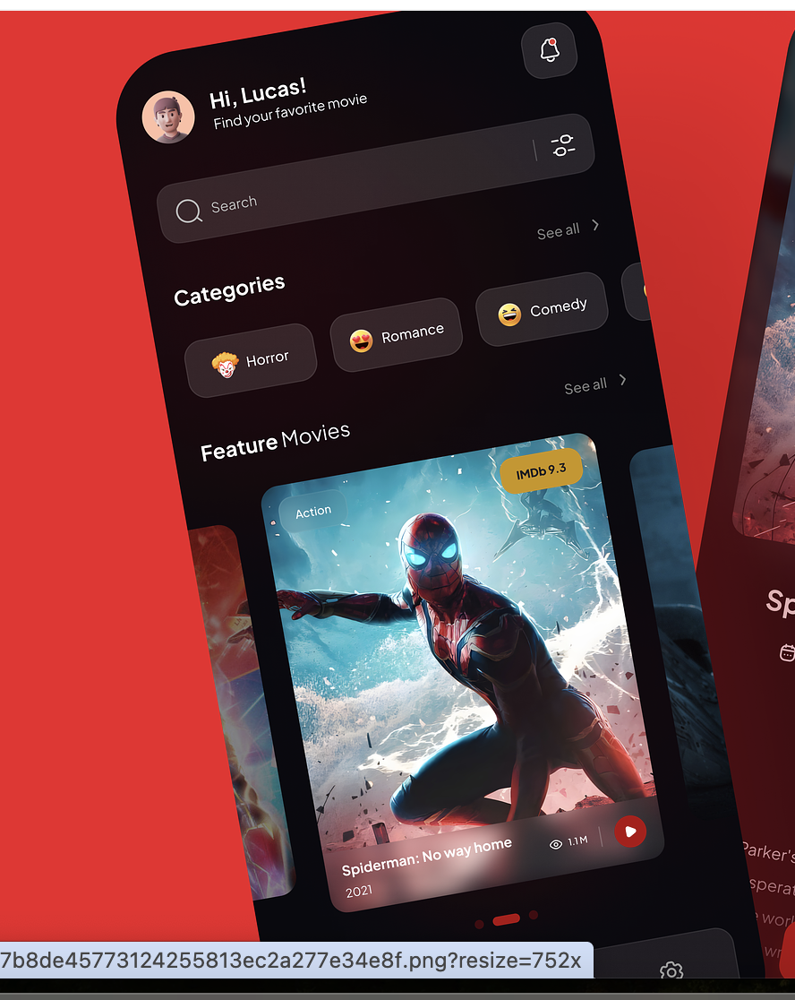
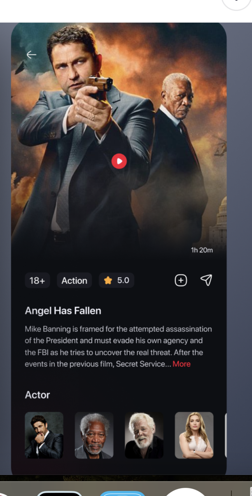

# cyber_speed

## In order to run this project on your machine or device

  <li>Clone the project. </li> 
  <li>get access to the project directory using command line <b>cd ~/cyber_speed</b>.</li> 
  <li><b>npm i</b> to install node packages.</li> 
  <li><b>npx pod-install</b> to install the pods</li> 
  <li><b>npx react-native run-android</b> or <b>npx react-native run-ios</b> in order to run the app on emulator/device, or open the folder  <b>~/cyber_speed/android</b> on Android Studio, and run emulator and  the file   <b>~/cyber_speed/ios/cyber_speed.xcworkspace</b> with Xcode </li> 
  
## Home Screen

  
  

## Movie Details Screen

  
  

## UI Inspiration

The UI is inspired from some dribbble projects.

  
  

## Network business logic SDK 
A network business logic SDK [tmbd_module_wk](https://www.npmjs.com/package/tmbd_module_wk) that encapsulates the logic for fetching movie data from the API is implemented within the project, we can simply switch the branch:[using-npm-package](https://github.com/0wissem/cyber_speed/tree/using-npm-package) to have a demonstration at home screen.

